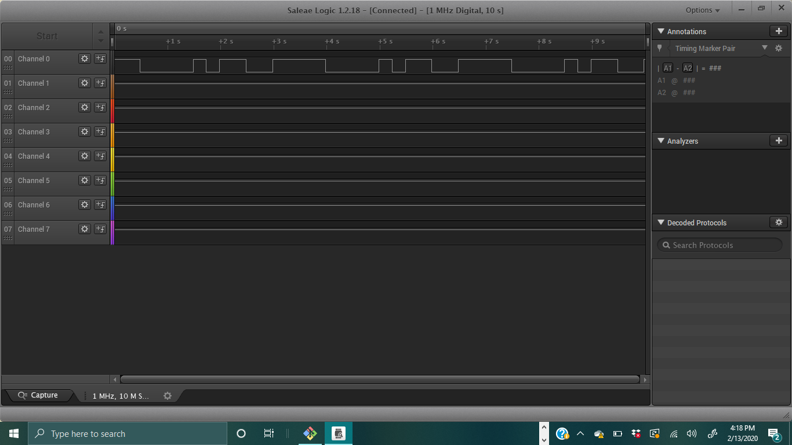
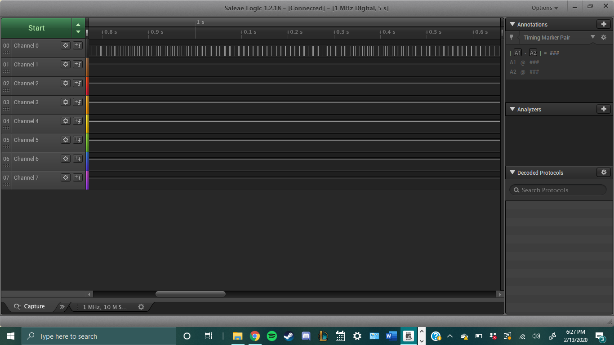
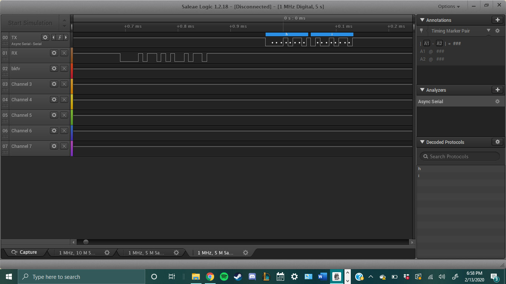
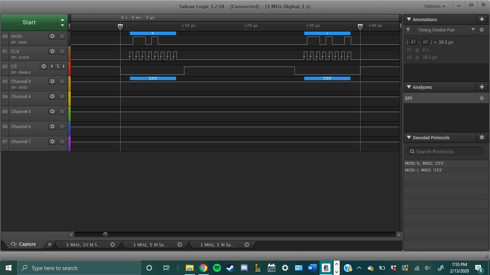

Name:

EID:

Team Number:

## Questions

1. Why does your program need a setup and a loop?

    The setup initializes variables and functions, while the loop performs our desired program

2. What is the downside to putting all your code in a loop?

    You end up repeating the initialization phase for every instance of the loop

3. Why does your code need to be compiled?

    When its compiled its translated into machine language which the board can understand

4. When lowering the frequency in procedure A, step 4, what is going wrong? Brainstorm some solutions. Dimmers exist in the real world. What is their solution?

    The dimming effect reduces as the duty cycle becomes more visable, the solution is to increase the duty cycle

5. Why do you need to connect the logic analyzer ground to the ESP32 ground?

    So that they both have the same baseline value for the GND

6. What is the difference between synchronous and asynchronous communication?

    Synchronous communication is synchonized with the system clock, with asynchrounous data you don't know when data is coming in and the system is constantly looking for data when there can potentially be no data

7. Profile of UART: Sent X bytes in Y time 

    2 bytes in .165 ms

8. Profile of SPI: Sent X bytes in Y time

    2 bytes in 38.5 microseconds

9. Why is SPI so much faster than UART?

    The clock rate of the SPI is much higheryour answer here

10. list one pro and one con of UART

    UART requires only 2 pins, but is slower than the SPI

11. list one pro and one con of SPI

    SPI is much faster than the UART, but requires 3 pins to run and potentially 4

12. list one pro and one con of I2C

    I2C only requires two wires and can support multiple slaves, but the lines are open drain and require pull up or pull down resistors

13. Why does I2C need external resistors to work?

    because the lines are open drain

## Screenshots

Procedure A, step 1:

Procedure A, step 4:

Procedure B, UART:

Procedure B, SPI:

